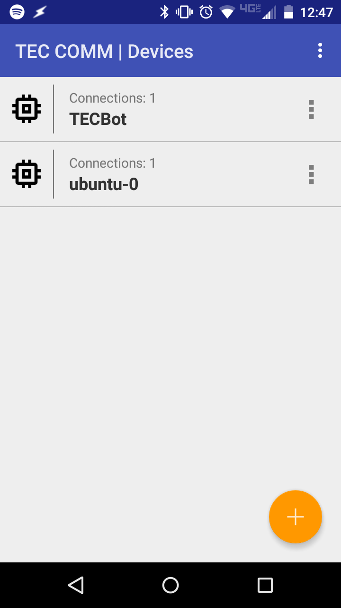
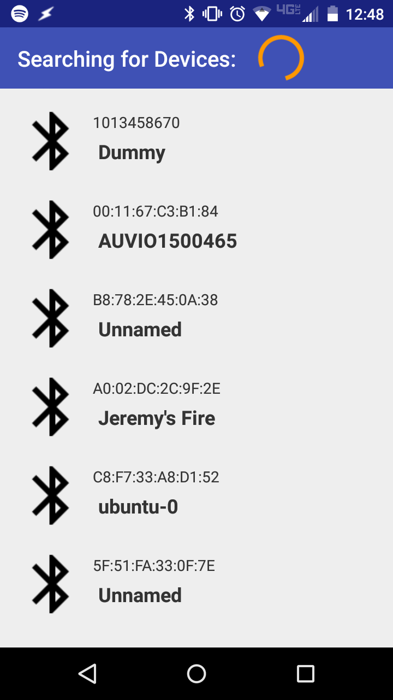
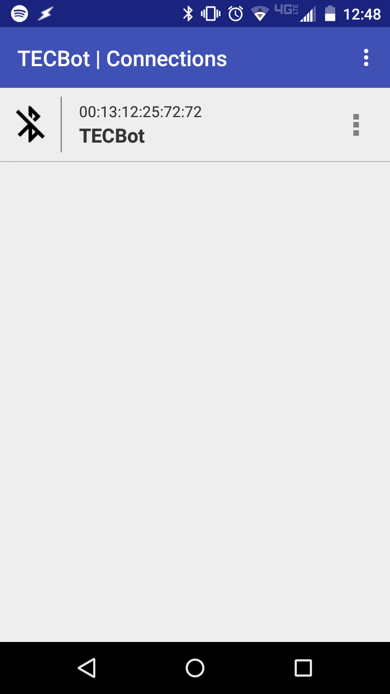
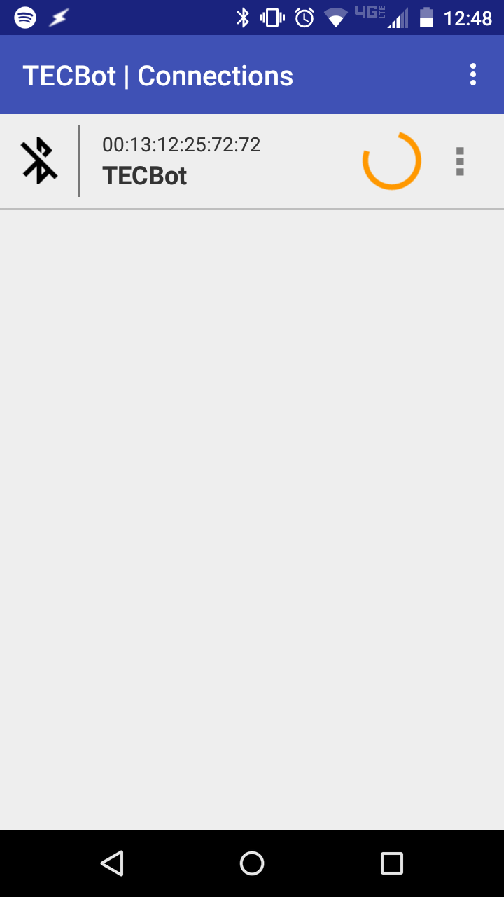
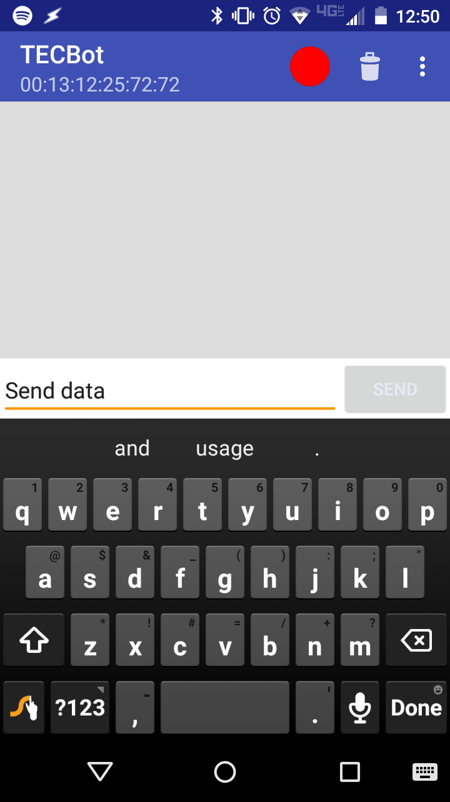

# TEC-COMM
Universal hobby project remote control app.

TEC-COMM is an Android open-source project whose goal is to provide a simple, clean interface for interacting with Arduino hobby robots through bluetooth or other communications protocols.  The vision is to have a user experience in which a user creates a device profile for a particular robot or project they want to control, then configures one or many communication avenues that will link the Android to that robot.  The pioneering interface will be Bluetooth, but I intend on adding Wifi, NFC, and perhaps IR for supporting hardware.  Eventually I hope to add customizeable UI elements that can be used as a virtual controller (much like a console remote).

If this seems like a project that you would be interested in contributing to, feel free to contact me at codewhisperer97@gmail.com

## Devices
The main screen displays all devices that have been configured with the app.

Clicking the "Add" action button takes us to the Device Discovery screen.

Currently only Bluetooth is implemented, but the code framework is built in anticipation of Wifi and other connection interfaces.  Clicking a discovered connection item adds it to a new Device profile and displays it on the main screen.

Each Device can have multiple Connections configured.  This means that a single project can communicate through one or more Bluetooth connections and, in the future, Wifi and other interfaces.  Clicking on a Connection attempts to establish an active channel through that interface, readying it for use.

After establishing connection, the Connection's list entry can be clicked to open a terminal-like interface, in which data can be sent to and received from the remote device.  This data can be seen as clear text on the remote device.

